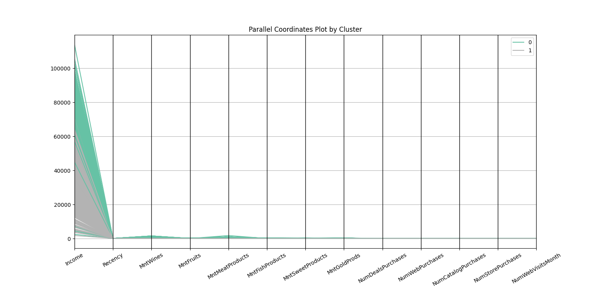
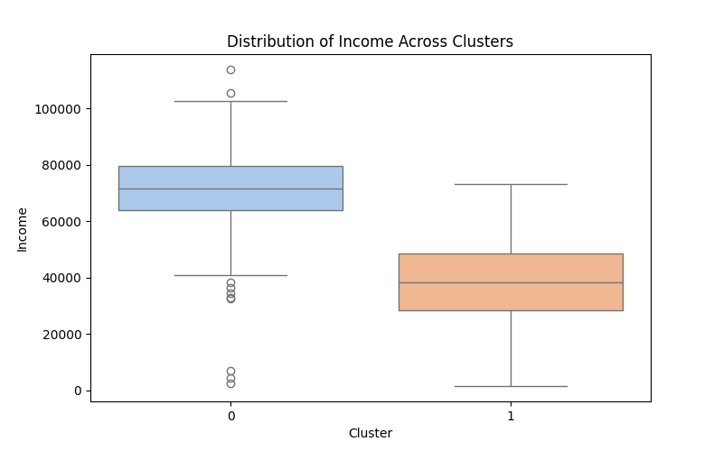
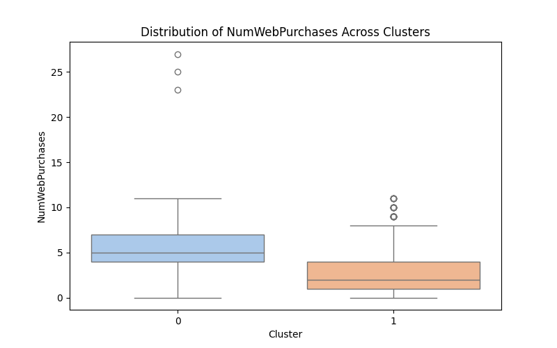

# Project Visualizations

## 1. Pairplot of Selected Features
Explores key statistical relationships and distributions of important customer features.  

## 2. Elbow and Silhouette Analysis
Helps determine the optimal number of clusters to use.  

## 3. Cluster Profiles Heatmap
Shows average feature values per cluster.  

## 4. Parallel Coordinates Plot
Visualizes customer feature profiles by cluster membership.  

## 5. Box Plot - Income by Cluster
Distribution and median income differences between clusters.  

## 6. Box Plot - Recency by Cluster
Recency distribution shows no major differentiation.  

## 7. Box Plot - Wine Spending
Highlights significant spending differences.  

## 8. Box Plot - Online Purchases
Cluster differences in online shopping frequency.  

