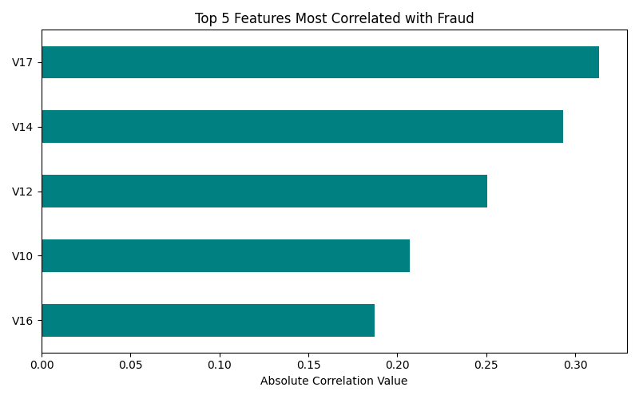
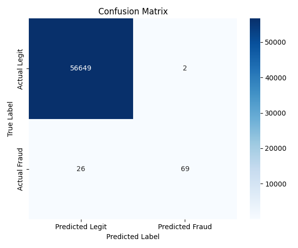
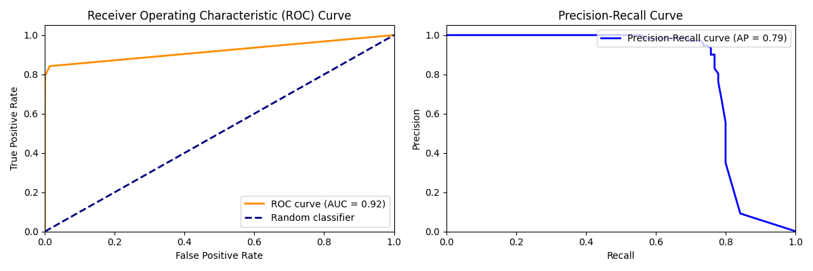
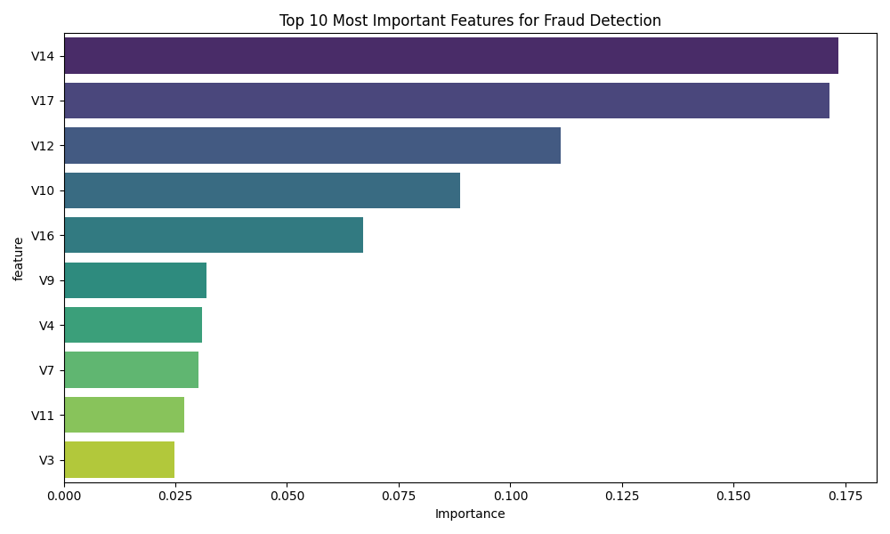

# Project Visualizations

## 1. Transaction Class Counts
Shows the distribution of legitimate vs fraudulent transactions.  

## 2. Transaction Amount by Class
Box plot showing variation in transaction amounts for legit and fraud cases.  

## 3. Fraudulent Transactions by Hour of Day
Bar plot depicting hourly distribution of fraudulent transactions.  

## 4. Pairplot of Selected Features
Explores statistical relationships between anonymized features grouped by class.  

## 5. Correlation Matrix
Heatmap of correlations among features most correlated with fraud class.  

## 6. Logistic Regression Confusion Matrix
Performance visualization of Logistic Regression classifier.  

## 7. Random Forest Confusion Matrix
Performance visualization of Random Forest classifier.  

## 8. XGBoost Confusion Matrix
Performance visualization of XGBoost classifier.  

## 9. SHAP Feature Importance - Random Forest
Bar plot showing average impact of features on model output.  

## 10. SHAP Summary Plot - Random Forest
Summary of SHAP values showing feature effects across samples.  

## 11. Model ROC Curves Comparison
ROC curves comparing model performances on test data.  

