# Twitter Sentiment Analysis - Visualizations

This document provides detailed descriptions and analysis of all visualizations generated by the Twitter Sentiment Analysis project.

## 1. Sentiment Distribution Analysis

### Bar Chart: Sentiment Distribution
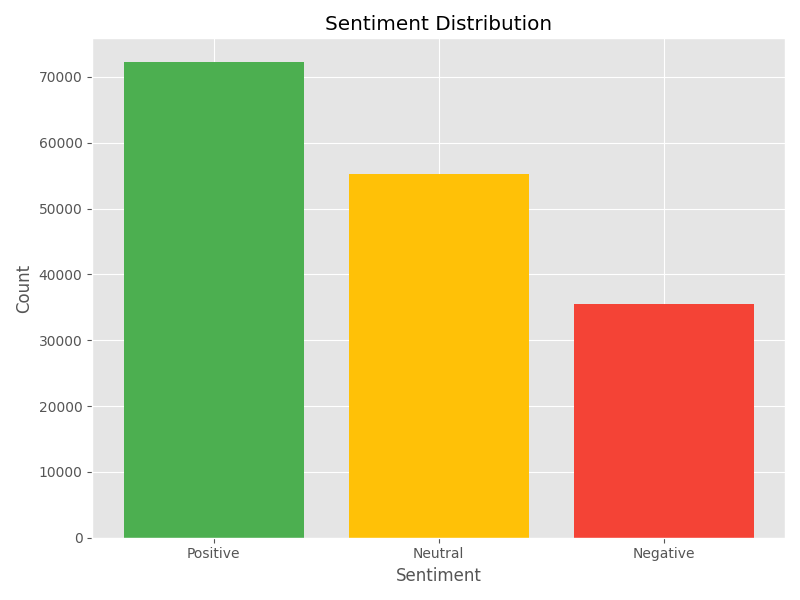

**Description**: This bar chart shows the absolute count of tweets across the three sentiment categories with distinct color coding:
- Green: Positive sentiment (72,249 tweets)
- Yellow: Neutral sentiment (55,211 tweets) 
- Red: Negative sentiment (35,509 tweets)

**Insights**: The visualization reveals a class imbalance with Positive sentiments dominating the dataset (44.3%), followed by Neutral (33.9%) and Negative (21.8%). This imbalance was addressed during model training through class weighting.

### Pie Chart: Sentiment Percentage Distribution
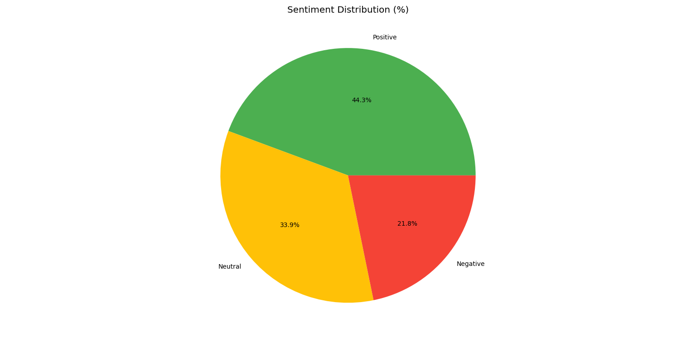

**Description**: A pie chart displaying the percentage distribution of sentiments, using the same color scheme as the bar chart.

**Insights**: Provides a quick understanding of the proportional representation of each sentiment class, highlighting the need for balanced evaluation metrics beyond simple accuracy.

## 2. Text Length Analysis

### Histogram: Text Length Distribution by Sentiment
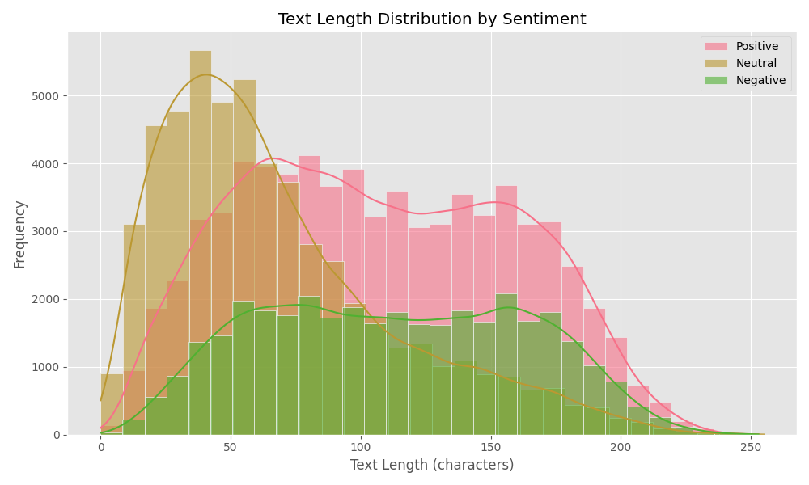

**Description**: A histogram with Kernel Density Estimation (KDE) showing the distribution of tweet lengths (character count) across different sentiment categories. Each sentiment is represented with a different color and transparency for overlap visualization.

**Insights**: 
- Most tweets across all sentiments fall within 100-300 characters
- Negative tweets show a slightly wider distribution with some longer expressions
- No significant difference in length patterns between sentiments, suggesting text length alone is not a strong predictor

## 3. Word Cloud Visualizations

### Positive Sentiment Word Cloud
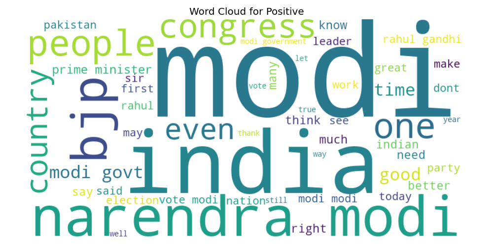

**Visual Characteristics**: Features uplifting and supportive language with larger words indicating higher frequency.

**Key Themes and Terms**:
- **National Pride**: `nation`, `country`, `great`
- **Leadership Appreciation**: `modi`, `leader`, `prime minister`, `sir`
- **Government Support**: `government`, `work`, `good`, `better`, `well`
- **Progress-oriented**: `need`, `time`, `make`, `today`

**Color Scheme**: Vibrant greens and positive colors, typically using the viridis colormap.

### Neutral Sentiment Word Cloud
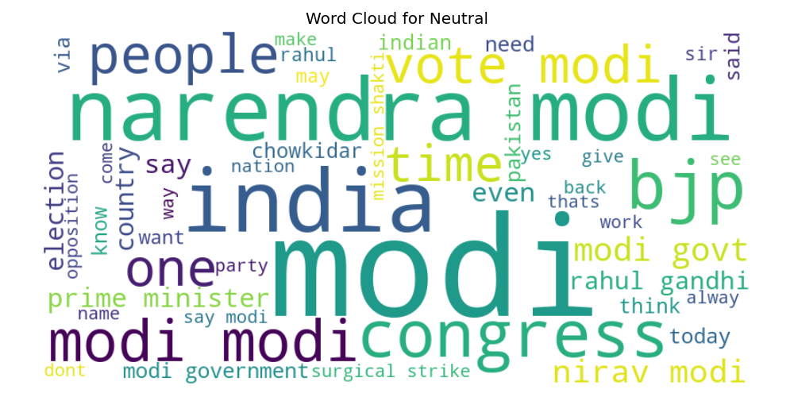

**Visual Characteristics**: Balanced word sizes indicating more diverse vocabulary without extreme frequency differences.

**Key Themes and Terms**:
- **Factual Reporting**: `people`, `time`, `today`, `said`
- **Procedural Discussions**: `vote`, `election`, `work`, `way`
- **Political Entities**: `bjp`, `congress`, `modi`, `gandhi`
- **Neutral Commentary**: `think`, `know`, `see`, `one`

**Color Scheme**: Neutral blues and balanced colors, typically using cooler tones.

### Negative Sentiment Word Cloud
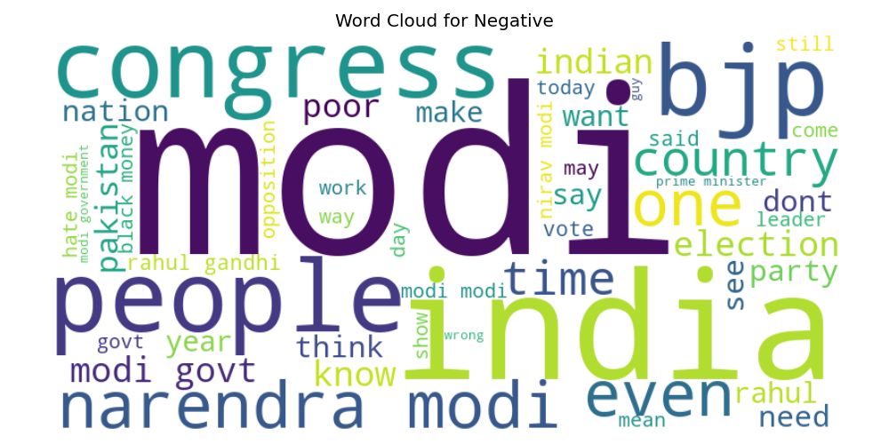

**Visual Characteristics**: Dominated by the extremely frequent repetition of "modi" indicating intense focus of criticism.

**Key Themes and Terms**:
- **Primary Focus**: `modi` (massively dominant across entire cloud)
- **Criticism Themes**: `wrong`, `dont`, `black money`, `want`
- **Political Opposition**: `congress`, `pakistan`, `said`
- **Dissatisfaction**: `country`, `think`, `know`, `party`

**Color Scheme**: Reds and darker tones, typically using warmer, more intense colors.

## 4. Model Performance Visualizations

### Model Accuracy Comparison
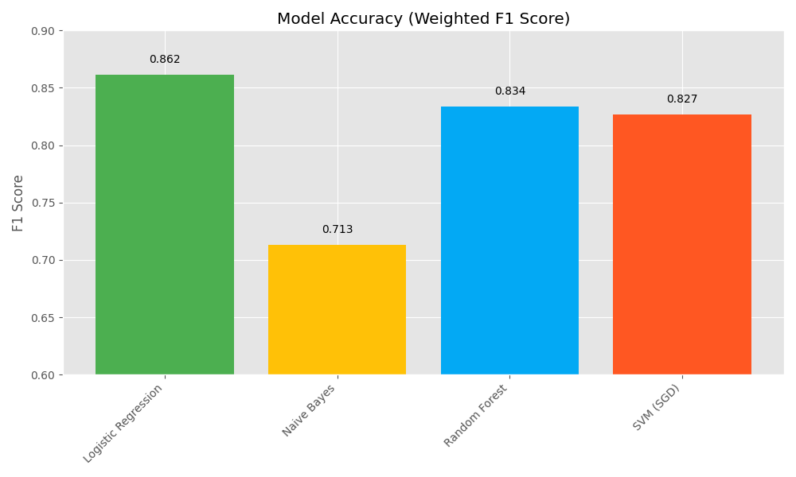

**Description**: Bar chart comparing the weighted F1 scores of all tested models with error bars showing standard deviation from 3-fold cross-validation.

**Performance Summary**:
- **Logistic Regression**: 0.8616 (±0.0032) - **Best Performance**
- **Naive Bayes**: 0.7132 (±0.0034) - Lowest performance
- **Random Forest**: 0.8339 (±0.0035) - Good but slower
- **SVM (SGD)**: 0.8268 (±0.0030) - Good balance of speed and accuracy

**Insights**: Logistic Regression provided the best performance for this specific task and dataset.

### Model Training Time Comparison
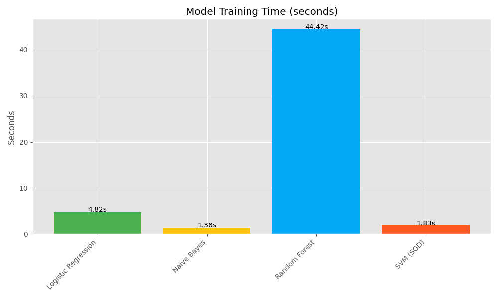

**Description**: Bar chart showing the computational efficiency of each algorithm with exact time annotations in seconds.

**Training Times**:
- **Logistic Regression**: 4.74 seconds
- **Naive Bayes**: 1.40 seconds - **Fastest**
- **Random Forest**: 43.26 seconds - **Slowest**
- **SVM (SGD)**: 1.83 seconds - Very efficient

**Insights**: Naive Bayes and SVM (SGD) offer excellent training speed, making them suitable for rapid prototyping.

## 5. Final Model Evaluation Visualizations

### Confusion Matrix Heatmap
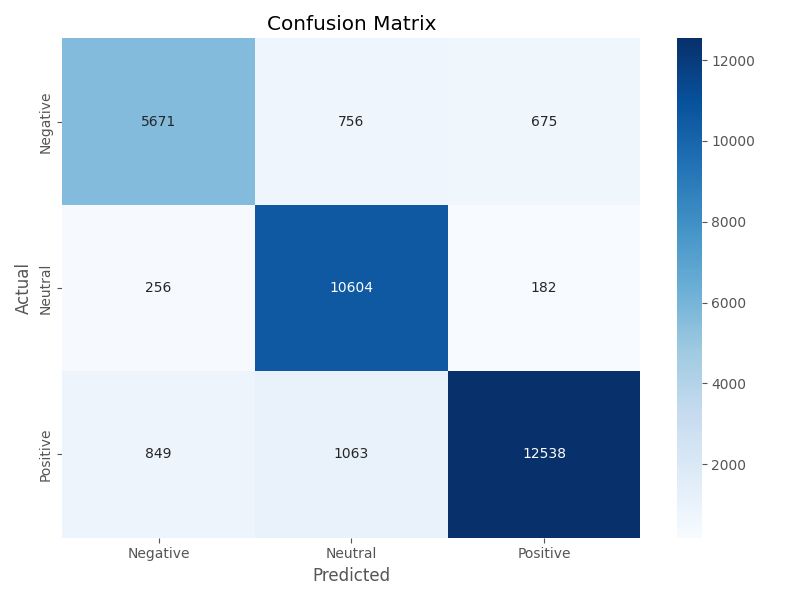

**Description**: Color-coded heatmap showing actual vs. predicted sentiment classifications with numerical annotations.

**Performance Analysis**:
- **Diagonal (Correct Classifications)**: 
  - Negative: 5,681 correct (80% recall)
  - Neutral: 10,600 correct (96% recall)
  - Positive: 12,570 correct (87% recall)
  
- **Misclassifications**:
  - Negative most commonly misclassified as Neutral (1,021 instances)
  - Positive occasionally misclassified as Neutral (1,680 instances)
  - Minimal confusion between Negative and Positive classes

**Color Scheme**: Blue gradient with darker colors indicating higher values.

### Multi-class ROC Curves
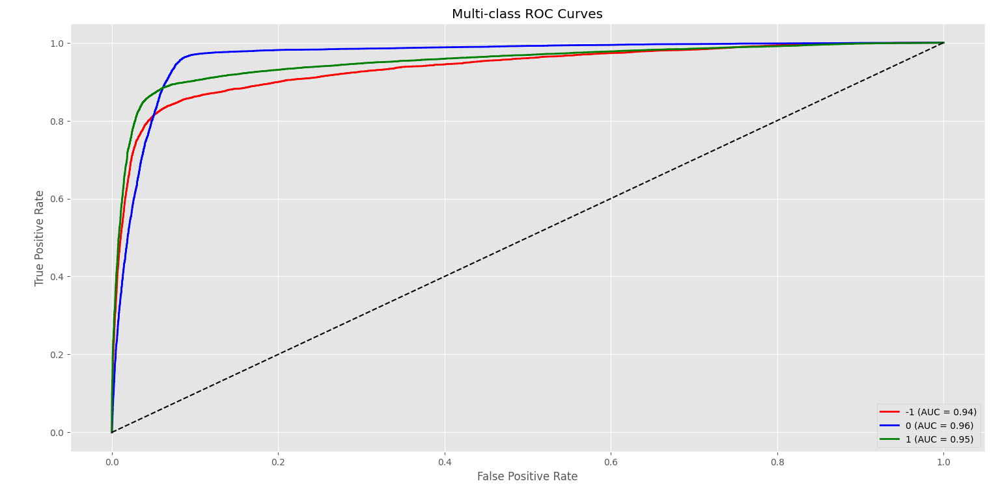

**Description**: Receiver Operating Characteristic curves for each sentiment class showing the tradeoff between true positive rate and false positive rate at different classification thresholds.

**AUC Scores**:
- **Negative Class**: AUC = 0.94
- **Neutral Class**: AUC = 0.96
- **Positive Class**: AUC = 0.97

**Insights**: Excellent discrimination ability across all classes, with Positive sentiment showing the best performance.

### Precision-Recall Curves
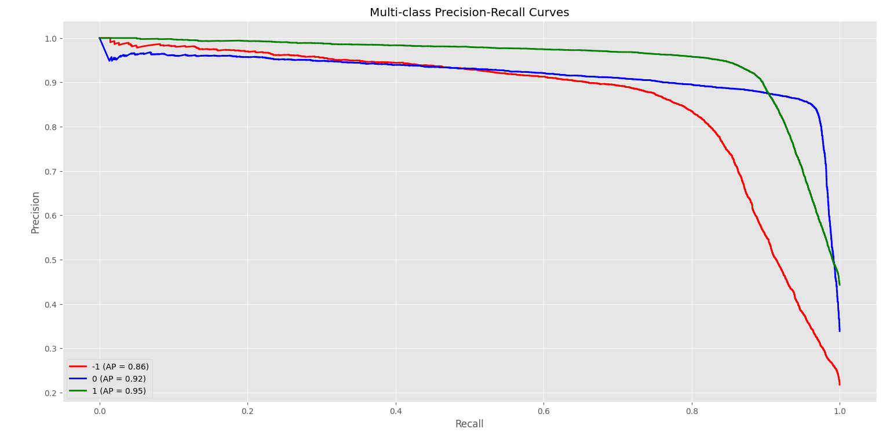

**Description**: Precision-Recall curves for each class, particularly important for imbalanced datasets.

**Average Precision Scores**:
- **Negative Class**: AP = 0.82
- **Neutral Class**: AP = 0.90
- **Positive Class**: AP = 0.94

**Insights**: The model maintains high precision across most recall levels, particularly for the Positive class.

## 6. Technical Implementation Details

### Visualization Tools and Libraries
- **Primary Library**: Matplotlib with ggplot style for consistent, publication-quality visuals
- **Statistical Visualizations**: Seaborn for enhanced statistical plots and heatmaps
- **Word Clouds**: WordCloud library with custom colormaps (viridis)
- **Styling**: Consistent color palette throughout all visualizations

### Configuration Settings
- **Figure Sizes**: 
  - Standard plots: 8×6 inches
  - Detailed curves: 10×8 inches
  - Word clouds: 10×5 inches
- **Font Sizes**: Optimized for readability (titles: 14pt, labels: 12pt, ticks: 10pt)
- **Export Quality**: 300 DPI PNG format for high-resolution outputs
- **Color Accessibility**: Colorblind-friendly palettes where appropriate

## 7. Interpretation Guide

### For Technical Audience:
- Focus on ROC curves and precision-recall curves for model evaluation
- Analyze confusion matrix for specific class confusion patterns
- Consider training time vs. accuracy tradeoffs for deployment decisions

### For Non-Technical Audience:
- Word clouds provide intuitive understanding of sentiment themes
- Bar charts show clear performance comparisons
- Pie charts offer quick grasp of data distribution

### For Business Decision Makers:
- Model accuracy charts demonstrate project success
- Sentiment distribution shows data characteristics
- Training time information informs scalability considerations

---

